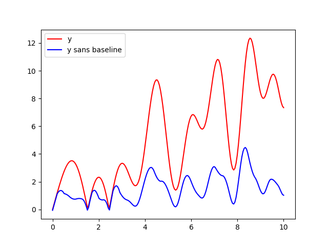

# baseline-cleaner
Implementation of the baseline cleaner from the paper "Efficient and Effective Baseline Correction Algorithm for Raman Spectra" by Yung-Sheng Chen & Yu Hsu. We consider the baseline a chunk of space under a curve that separates the curve from the axis. In their paper they apply the algorithm to Raman spectra in chronography. The algorithm does also work for other signals. 

The picture below comes from the demo file - removing the baseline from the trigonometric curve 
. 

